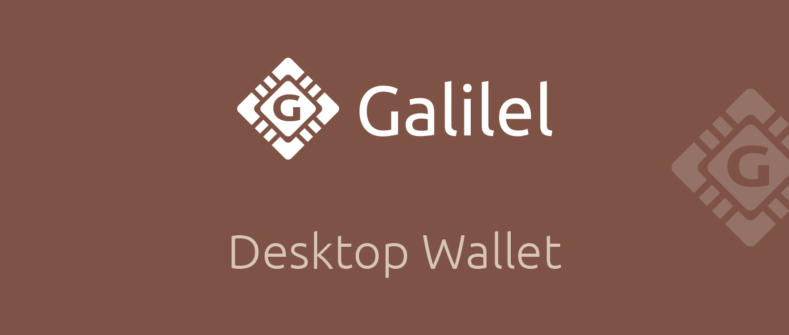
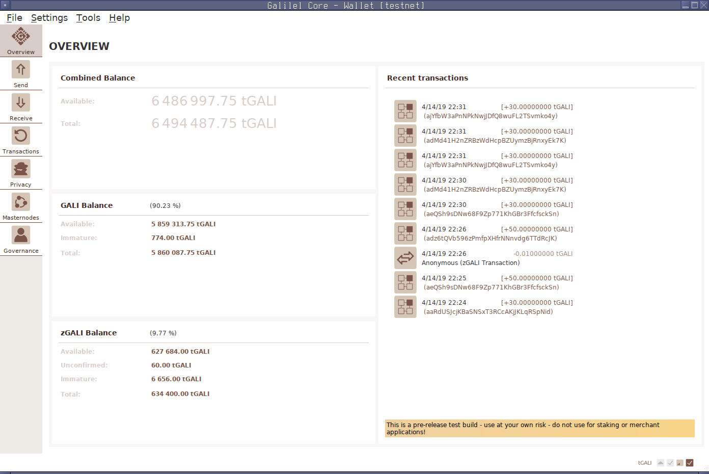
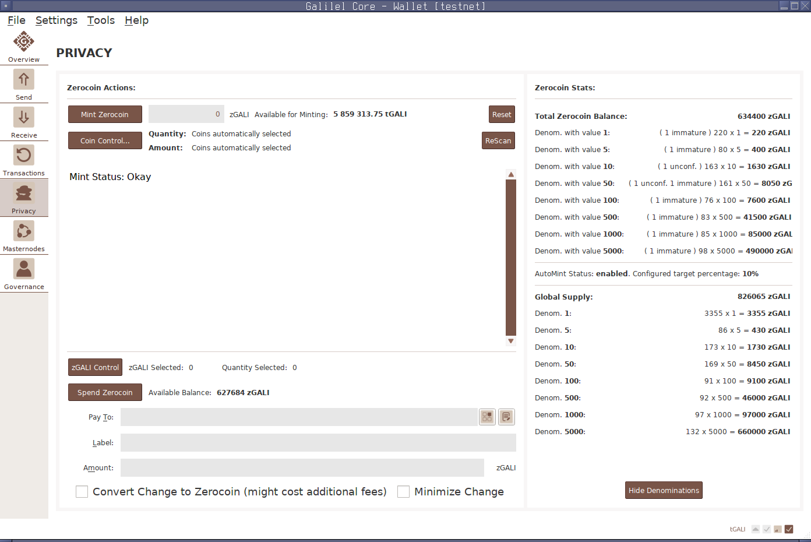

# Galilel Core

The first Proof-of-Work, Proof-of-Stake, Proof-of-Burn and Proof-of-Transaction
general purpose crypto currency with Hybrid Consensus Algorithm, Dynamic
Zerocoin and Masternode voting for period based reward burning.

Galilel Coin (GALI and zGALI) is an open-source public and private
Proof-of-Stake digital crypto currency for fast (using SwiftX), private
(Zerocoin protocol) and secure micro transactions. Our main goal is to create a
decentralized fully secure and anonymous network to run applications, which do
not rely on any central body control. By having a distributed system, thousands
of users will be responsible for maintaining the application and data so that
there is no single point of failure.

While Zerocoin solves the traceable reward generation problem, Galilel will
implement hybrid mobile Proof-of-Stake (ghPoS) for public and private coins.
The Term Deposit (gTD) function allow to lock coins for a certain period and
generate predictable rewards. Masternode owners get the possibility to vote for
reward reduction or complete burning for a specific period to reduce coin
generation. The Galilel Money Supply Control (gMSC), effectively Proof-of-Burn
v2 burns only rewards, never term deposits and development budget. The period
for coin burning will be 1 month with a range between 0% - 100%. Every month is
applicable for voting. Galilel Instant On Masternode (gIOMN) implements a
shared blockchain to run one-to-many wallet daemons in a client server model.
It is comparable to "Instant On" model available in Electrum client.

Galilel v3.1.0 is the worlds first crypto currency which has proportional
Zerocoin Proof-of-Stake (zPoS) rewards depending on the block reward!

# Coin Specifications

* Coin Name: Galilel
* Coin Ticker: GALI
* Hash Algorithm: Quark
* Consensus Algorithm: PoS + zPoS Hybrid
* Block Size: 2 MB
* Block Time: 60 Seconds (Re-targeting every block)
* RPC Port: 36002
* P2P Port: 36001
* Type: PoW / PoS / zPoS / MN
* Minimum Staking Age: 2 Hours
* Maturity: 120 confirmations
* Send Eligibility: 6 confirmations
* Rewards (till block 1,500): MN 60%, PoW 40%
* Rewards (till block 205,000): MN 60%, PoS 40%
* Rewards (from block 205,001): MN 70%, PoS 30%
* Last PoW Block: 1,500
* Masternode Collateral: 15,000
* Max Coin Supply (January 2020): 19,035,999 GALI
* Max Coin Supply (January 2030): 45,315,999 GALI
* Max Coin Supply (January 2040): 71,595,999 GALI
* Max Coin Supply (January 2050): 97,875,999 GALI
* Dynamic Coin Supply: All transaction fees & zGALI minting fees are burnt
* Community Donation Address: https://explorer.galilel.org/address/UUr5nDmykhun1HWM7mJAqLVeLzoGtx19dX
* Multisig Budget Address (3-of-6): https://explorer.galilel.org/address/7U3FMDhKv4j5bzauurPoX1TtqE7hPowSJi
* Dev Budget (from block 250,001): 10% in monthly superblock

# Zerocoin Specifications

* Zerocoin v1 activation: block 245,000
* Zerocoin v2 activation: block 245,000
* zGALI Automint: 10%
* zGALI Rewards (from block 245,001): 1 zGALI
* zGALI Rewards (from block 340,001): MN 40%, PoS 60%
* zGALI Rewards (from block 430,001): MN 40%, PoS 60%
* zGALI Denominators: 1, 5, 10, 50, 100, 500, 1000, 5000
* Accumulator Modulus: RSA-2048
* Maturity: 240 confirmations
* Send Eligibility: 20 confirmations
* Fees (mint): 0.01 GALI per minted zGALI denomination
* Fees (spend): No fee

With Zerocoin v2 activation at block 245,001 the reward structure becomes
dependent from the staking type. If public Proof-of-Stake (GALI) and staker
finds a block, 70% paid to masternode and 30% to staker. If private
Proof-of-Stake (zGALI) and staker finds a block, 40% paid to masternode and 60%
to staker.

# Proof-of-Work Rewards

Proof-of-Work is used as instamine protection and will end at block 1500.

Block Height    | Reward                 | MN  | PoW | Supply  | Runtime | Stage End
----------------|------------------------|-----|-----|---------|---------|-----------
Block 1         |      50 GALI           | 60% | 40% | 220,000 | 0 days  | 2018-05-25
Block 2         | 220,000 GALI (premine) | 60% | 40% | 220,000 | 0 days  | 2018-05-25
Block 3 - 1,500 |       1 GALI           | 60% | 40% | 221,499 | 1 day   | 2018-05-26

# Proof-of-Stake Rewards

Proof-of-Stake will start at block 1501.

Stages  | Block Height    | Reward    | MN  | PoS | Supply     | Runtime | Stage End
--------|-----------------|-----------|-----|-----|------------|---------|-----------
Stage 1 |    1,501-12,000 |  100 GALI | 60% | 40% |  1,271,399 |  7 days | 2018-06-02
Stage 2 |   12,001-22,000 |   90 GALI | 60% | 40% |  2,171,309 |  7 days | 2018-06-09
Stage 3 |   22,001-42,000 |   80 GALI | 60% | 40% |  3,771,229 | 14 days | 2018-06-23
Stage 4 |  42,001-100,000 |   70 GALI | 60% | 40% |  7,831,159 | 40 days | 2018-08-02
Stage 5 | 100,001-160,000 |   60 GALI | 60% | 40% | 11,431,099 | 42 days | 2018-09-13
Stage 6 | 160,001-205,000 |   50 GALI | 60% | 40% | 13,681,049 | 31 days | 2018-10-14
Stage 7 | 205,001-250,000 |   25 GALI | 70% | 30% | 14,806,024 | 31 days | 2018-11-14
Stage 8 | 250,001-340,000 | 13.5 GALI | 70% | 30% | 16,156,009 | 62 days | 2019-01-15
Stage 9 | 340,001-430,000 |   10 GALI | 70% | 30% | 17,055,999 | 62 days | 2019-03-18
Stage X | 430,001-ongoing |    5 GALI | 70% | 30% |    ongoing | ongoing |    ongoing

# Official Links

Website: https://galilel.org/

GitHub (Wallet): https://github.com/Galilel-Project/galilel/

GitHub (Project): https://github.com/Galilel-Project/

Block Explorer (Mainnet) : https://explorer.galilel.org/

Block Explorer 2 (Mainnet Aiodex): https://explorer.aiodex.com/GALI

Block Explorer (Testnet): https://explorer.testnet.galilel.org/

BitcoinTalk Announcement: https://bitcointalk.galilel.org

Twitter: https://twitter.com/GalilelEN

Facebook: https://facebook.com/GalilelEN

YouTube: https://youtube.com/channel/UC26rKBciicXp33dK8NkALmg

Instagram: https://instagram.com/galilel_en/

Discord: https://discord.galilel.org

Telegram: https://t.me/GalilelEN

Know Your Developer (KYD): https://review.kydcoin.io/galicoin/

# Exchanges

Graviex: https://graviex.net/markets/galibtc

Crex24: https://crex24.com/exchange/GALI-BTC

Aiodex (BTC): https://aiodex.com/exchange/GALI_BTC

Aiodex (GEEK): https://aiodex.com/exchange/GALI_GEEK

Cratex (BTC): https://cratex.io/index.php?pair=GALI/BTC

Cratex (LTC): https://cratex.io/index.php?pair=GALI/LTC

Cratex (BTCZ): https://cratex.io/index.php?pair=GALI/BTCZ

Raisex: https://raisex.io/trade/GALI_BTC

MCT+: https://trade.mct.plus/

FinexBox: https://www.finexbox.com/market/pair/GALI-BTC.html

Block DX: https://blocknet.co/galilel-2/

Bisq: https://bisq.network/markets/?currency=gali_btc

Amsterdex: https://amsterdex.com/exchange?market=gali

# Promotions

CoinMarketCap: https://coinmarketcap.com/currencies/galilel/

Masternodes.online: https://masternodes.online/currencies/GALI/

Coinlib.io: https://coinlib.io/coin/GALI/Galilel

MNtop: https://mntop.co.in/

mnode.club: https://mnode.club/g/info/GALI

Beam: https://beam.works/user/galilel/

Satoshi Solutions: https://satoshisolutions.online/

Chopcoin.io: https://gali.chopcoin.io/

NodeCheck.io: https://nodecheck.io/currency/GALI

CoinCodex: https://coincodex.com/crypto/galilel/

CoinGecko: https://coingecko.com/en/coins/galilel

WorldCoinIndex: https://worldcoinindex.com/coin/galilel

Dextro: https://dextro.io/

Coinranking: https://coinranking.com/coin/galilel-gali

CoinLore: https://coinlore.com/coin/galilel

Gremlins Marketing: http://gremlinsmarketing.com/galilel/

MNTrend: https://mntrend.com/en/currencies/GALI

CoinMarketDaddy: https://coinmarketdaddy.com/currencies/galilel/

I Host MN: https://ihostmn.com/hostmn.php?coin=GALI

MN ROI: https://www.mnroi.info/coin/GALI

PoS List: https://www.poslist.org/

Nodeasy: https://nodeasy.com/currencies/Galilel

Simpleco.in: https://simpleco.in/

Pecunia: https://pecuniaplatform.io/

GIN Platform: https://p.ginplatform.io/

Kalkulus Hub: https://hub.kalkul.us/

CryptoCompare: https://www.cryptocompare.com/coins/gali/overview

Pecunia: https://pecuniaplatform.io/99HOST

Blockspot.io: https://blockspot.io/coin/galilel/

Crypos: https://crypos.io/

Masternodes Germany: https://masternodes-germany.de/

# Merchants

Dextro: https://dextro.io/

# Donations

Galilel (GALI): UUr5nDmykhun1HWM7mJAqLVeLzoGtx19dX

Bitcoin (BTC): 13vZmvxWcpMxZPr2gtf4QBS8Q2En6kB3mo

Litecoin (LTC): MAfouCFTBX4hJWTmAvTpFSuwzUZr4gtxDv

Dogecoin (DOGE): DFY1iAcbX8uQDaFAFQckSGJfYBb6QzTuMi

# Development

Starting from v3.1.0, we are using branches for changes, which will fork the
chain. Any fixes and improvements, which does not fork the chain, will be
committed directly into master branch.

# Wallet Screenshots

Since refactoring of Galilel v3.x with PIVX 3.1.1 codebase, the wallet supports
zGALIv1 minting and spending. Wallet and Zerocoin privacy screenshot:

